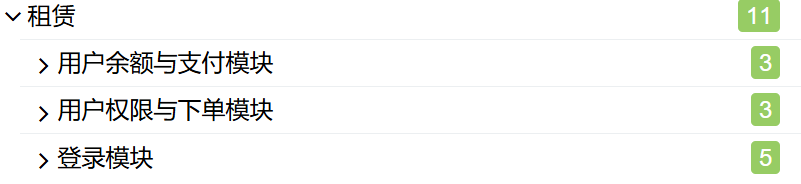
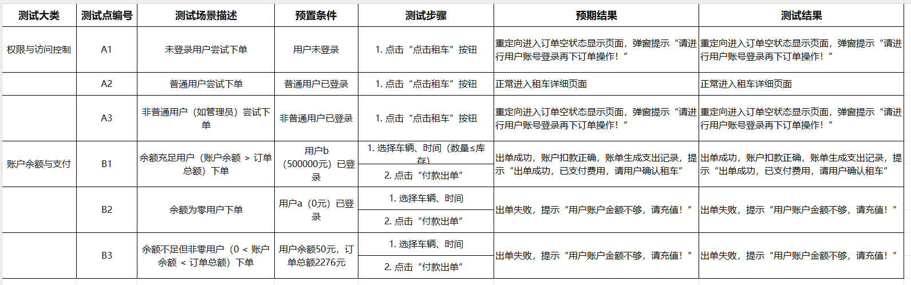
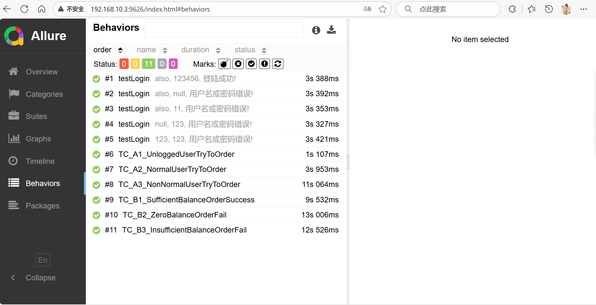

# carfront-selenium
租赁系统前台测试脚本
技术：Java + Selenium + TestNG，Page Object模式、数据驱动、Allure  
## 测试范围：
  

(1)登录功能模块  
(2)下订单功能模块如下图所示：  
    

## 运行
testng.xml  
批量执行测试用例  
mvn clean test  
生成allure报告  
mvn io.qameta.allure:allure-maven:serve  

